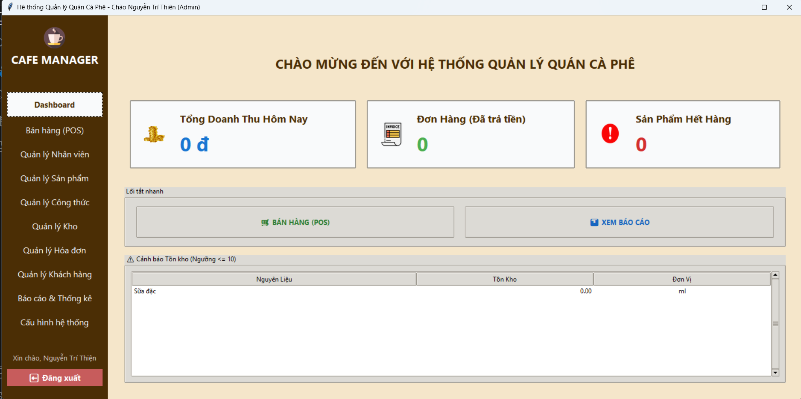

# Đồ án Môn học: Hệ thống Quản lý Quán Cà Phê (POS)

Đây là dự án đồ án môn học Chuyên Đề PyThon xây dựng một ứng dụng Desktop (Client-Server) hoàn chỉnh bằng Python (Tkinter) và SQL Server, mô phỏng nghiệp vụ của một hệ thống Bán hàng tại quầy (POS) chuyên nghiệp.

Sinh viên thực hiện : 1. Nguyễn Trí Thiện - DTH235774
                      2. Trần Lê Hửu Lý - DPM235447



---

## 1. Công nghệ & Thư viện Sử dụng

Hệ thống được xây dựng trên kiến trúc Client-Server (2-Tầng) và sử dụng các công nghệ sau:

* **Ngôn ngữ Lõi:** Python 3.11
* **Cơ sở dữ liệu:** Microsoft SQL Server
* **Giao diện Người dùng (GUI):**
    * `Tkinter (ttk)`: Thư viện GUI tiêu chuẩn của Python.
    * `Pillow (PIL)`: Xử lý, resize và hiển thị hình ảnh (PNG/JPG) trong giao diện.
    * `tkcalendar`: Tiện ích DateEntry (chọn ngày) cho các module báo cáo và chấm công.
* **Kết nối CSDL & Hệ thống:**
    * `pyodbc`: Trình kết nối (driver) chính thức để giao tiếp với SQL Server.
    * `pywin32`: Sử dụng cho API in ấn (`win32print`) của Windows.
* **Báo cáo & Xuất file:**
    * `matplotlib`: Vẽ và nhúng các biểu đồ (đường, cột, tròn) trong Module Báo cáo.
    * `numpy`: (Thư viện phụ thuộc lõi) Cung cấp nền tảng toán học cho `matplotlib`.
    * `fpdf2`: Tạo và xuất hóa đơn ra file PDF (hỗ trợ đầy đủ font Tiếng Việt Unicode).
    * `openpyxl`: Xuất dữ liệu (ví dụ: Bảng lương) ra file Excel (`.xlsx`).
* **Bảo mật & Đóng gói:**
    * `bcrypt`: Mã hóa và xác thực mật khẩu người dùng (an toàn hơn MD5/SHA256).
    * `pyinstaller`: Đóng gói toàn bộ dự án (code, ảnh, font) thành một file `.exe` duy nhất.

---

## 2. Giới thiệu Chung về Hệ thống

Ứng dụng được thiết kế theo mô hình `mainmenu` (sidebar) hiện đại, thay thế cho các cửa sổ rời rạc. Hệ thống được chia thành 9 module nghiệp vụ chính, tất cả đều được điều khiển từ một giao diện trung tâm.

* **Dashboard (Bảng điều khiển):** Màn hình chào mừng, hiển thị các chỉ số KPI quan trọng (Doanh thu, Đơn hàng) và Cảnh báo Tồn kho.
* **Bán hàng (POS):** "Trái tim" của hệ thống, nơi thu ngân thực hiện giao dịch, tích hợp trực tiếp với 5 module khác.
* **Quản lý Nhân viên:** Quản lý thông tin, ca làm, chấm công, và tự động tính lương.
* **Quản lý Sản phẩm:** Quản lý menu đồ uống/món ăn (tên, giá, ảnh).
* **Quản lý Công thức:** Liên kết Sản phẩm với Nguyên liệu (ví dụ: 1 Cà Phê Sữa = 25g cà phê + 30ml sữa).
* **Quản lý Kho:** Quản lý Nguyên liệu (tên, đơn vị, tồn kho) và các nghiệp vụ Nhập/Điều chỉnh kho.
* **Quản lý Hóa đơn:** Tra cứu, xem lại, và xuất PDF các hóa đơn đã được tạo từ POS.
* **Quản lý Khách hàng:** Quản lý thông tin khách hàng thân thiết và điểm tích lũy.
* **Báo cáo & Cấu hình:** Các module dành riêng cho Admin để xem thống kê và thay đổi logic nghiệp vụ.

---

## 3. Chi tiết Nghiệp vụ & Các Module

Phần này mô tả chi tiết các luồng nghiệp vụ và sự liên kết logic giữa các module.

### 3.1. Module Bán hàng (POS) - Trung tâm Tích hợp

Đây là module phức tạp nhất, được thiết kế để tối ưu tốc độ thao tác cho thu ngân.

* **Giao diện:** Sử dụng bố cục 2 cột.
    * **Cột 1 (Menu):** Hiển thị menu dưới dạng lưới hình ảnh 5 cột (đọc từ `SanPham.ImagePath`). Hỗ trợ cuộn chuột (mousewheel) để duyệt menu nhanh.
    * **Cột 2 (Hóa đơn):** Hiển thị giỏ hàng, thông tin khách hàng, và các nút thanh toán.
* **Tùy chỉnh Món (Modifiers):**
    * Khi nhân viên nhấp vào một món, một cửa sổ pop-up (đã được căn giữa) sẽ xuất hiện, cho phép nhập Ghi chú (ví dụ: "ít đường, nhiều đá").
    * Các món có ghi chú khác nhau (hoặc không có ghi chú) sẽ được thêm vào giỏ hàng dưới dạng **các dòng riêng biệt**.
* **Tương tác Giỏ hàng Nâng cao:**
    * Thu ngân không cần dùng nút bấm để sửa giỏ hàng.
    * **Double-click** vào một món để mở pop-up sửa số lượng.
    * Sử dụng phím **`+`**, **`-`**, và **`Delete`** để tăng/giảm/xóa món hàng đang chọn.
* **Tích hợp Logic (Luồng Thanh toán):** Khi nhấn "THANH TOÁN" (hoặc `F9`), hệ thống thực hiện 5 bước:
    1.  **(Module Khách hàng):** Kiểm tra xem khách hàng có được chọn (qua ô tìm kiếm real-time) và có sử dụng điểm (`DiemTichLuy`) không.
    2.  **(Lưu CSDL):** `INSERT` 1 dòng vào `HoaDon` (lưu `MaKH`, `GiamGia`, `DiemSuDung`...).
    3.  **(Lưu CSDL):** `INSERT` nhiều dòng vào `ChiTietHoaDon` (lưu cả cột `GhiChu` từ cửa sổ Tùy chỉnh Món).
    4.  **(Tích hợp Kho):** Gọi hàm `deduct_inventory_from_recipe`, tự động `JOIN` bảng `CongThuc` để `UPDATE` (trừ) `SoLuongTon` trong bảng `NguyenLieu` dựa trên các món vừa bán.
    5.  **(Tích hợp Điểm):** Gọi hàm `update_customer_points`, tự động trừ điểm đã sử dụng và cộng điểm mới tích lũy (dựa trên `vnd_per_point` trong `config.ini`) vào bảng `KhachHang`.
    6.  **(In ấn):** Hỏi người dùng có muốn in hóa đơn (dùng `win32print`) hay không.

### 3.2. Module Dashboard & Báo cáo

* **Dashboard:** Khi khởi động, Dashboard gọi `get_dashboard_kpis` để hiển thị 3 thẻ KPI (Doanh thu hôm nay, Đơn hàng hôm nay, SP Hết hàng) và `get_low_stock_alerts` để điền vào `Treeview` cảnh báo các nguyên liệu sắp hết hàng.
* **Báo cáo:** Sử dụng `matplotlib` để vẽ 3 loại biểu đồ: Doanh thu (biểu đồ đường), Top Sản phẩm (biểu đồ cột), và Phân bổ Lương (biểu đồ tròn).

### 3.3. Module Quản lý (Tối ưu hóa)

* **Quản lý Hóa đơn:** Đã "tối thiểu hóa". Chức năng "Thêm" đã bị loại bỏ (nghiệp vụ này thuộc về POS). Module này chỉ dùng để **Tra cứu**, **Xem Chi tiết** (Read-only), **Xóa** (nếu hóa đơn chưa thanh toán), và **Xuất PDF** (sử dụng `fpdf2` và font Tiếng Việt `DejaVuSans`).
* **Quản lý Nhân viên:** Giao diện 4 tab.
    * `tab_info`: CRUD cho Nhân viên.
    * `tab_attendance`: CRUD cho Chấm công.
    * `tab_salary`: Tự động **Tính lương** (dựa trên `LuongCoBan * TongGio`) và cho phép **Xuất Excel** (dùng `openpyxl`).
* **Cấu hình Hệ thống:** Cho phép Admin (đã phân quyền) thay đổi trực tiếp logic nghiệp vụ (ví dụ: `vnd_per_point = 10000`) bằng cách đọc và ghi đè file `config.ini`.

---

## 4. Mô tả Nghiệp vụ Thực tế (Kịch bản Sử dụng)

Một kịch bản sử dụng thực tế của nhân viên thu ngân tại quán:

1.  **Đăng nhập:** Mở `main.exe`. Nhập `Tên đăng nhập` (ví dụ: `cafe_user`) và mật khẩu. Hệ thống xác thực (bcrypt) và mở Giao diện chính (Main Menu).
2.  **Xem Tổng quan:** Thu ngân liếc nhìn Dashboard, thấy thẻ "Sản Phẩm Hết Hàng" (0) và thẻ "Cảnh báo Tồn kho" (hiển thị "Cà phê bột" sắp hết).
3.  **Bắt đầu Bán hàng:** Nhấn nút "Bán hàng (POS)" (hoặc phím `Down` -> `Enter`).
4.  **Order Món 1:** Khách gọi "Cà phê sữa, ít đường".
    * Thu ngân nhấp vào ảnh "Cà Phê Sữa".
    * Cửa sổ Tùy chọn hiện ra. Thu ngân gõ "ít đường" (hoặc nhấn nút "Ít đường").
    * Nhấn "Xác nhận". Món hàng (`Cà Phê Sữa (ít đường)`) xuất hiện trong giỏ.
5.  **Order Món 2:** Khách gọi 2 ly "Bạc Xỉu".
    * Thu ngân nhấp vào ảnh "Bạc Xỉu". Cửa sổ Tùy chọn hiện ra.
    * Nhấn "Xác nhận" (không ghi chú). (Món "Bạc Xỉu" SL:1 xuất hiện).
    * Thu ngân nhấp 1 lần vào dòng "Bạc Xỉu" trong giỏ hàng (để focus) và nhấn phím `+` trên bàn phím.
    * Giỏ hàng cập nhật `SL: 2`.
6.  **Tích điểm:** Khách hàng đọc SĐT.
    * Thu ngân gõ SĐT vào ô "Tìm khách hàng".
    * Giao diện tự động cập nhật "Khách: Nguyễn Văn A (120 điểm)". Ô "Sử dụng điểm" sáng lên.
7.  **Sử dụng Điểm:** Thu ngân check vào ô "Sử dụng điểm". Label "Giảm giá" và "Khách cần trả" tự động cập nhật (ví dụ: giảm 12.000đ).
8.  **Thanh toán:** Thu ngân thông báo số tiền cuối cùng. Nhấn phím `F9` (hoặc nút "THANH TOÁN").
9.  Hệ thống hỏi "Xác nhận thanh toán?". Thu ngân nhấn "Yes".
10. **Hoàn tất:**
    * Hệ thống (ngầm) lưu `HoaDon`, `ChiTietHoaDon`, trừ `Cà phê bột`, `Sữa đặc`, `Đá viên` khỏi `NguyenLieu`, và cập nhật điểm (`-120 điểm`, `+ (điểm mới)`) cho `KhachHang`.
    * Hộp thoại "Thanh toán thành công" hiện ra.
    * Hộp thoại "Bạn có muốn in hóa đơn không?" hiện ra. Thu ngân nhấn "Yes". Máy in bill in hóa đơn.
    * Giỏ hàng tự động bị xóa sạch. Thu ngân sẵn sàng cho khách tiếp theo.

---

## 5. Cấu trúc Thư mục Dự án

Cấu trúc file đã được dọn dẹp và tổ chức cho việc đóng gói:

```
📁 Doan_Python/ (Thư mục gốc của dự án)
│
├── 📄 .gitignore           (Bỏ qua các file .venv, __pycache__)
├── 📄 config.ini           (File cấu hình CSDL và Nghiệp vụ - Đã mã hóa Base64)
├── 📄 requirements.txt     (Danh sách các thư viện pip cần cài đặt)
├── 📄 README.md            (Tài liệu này)
│
├── 📁 app/                  (Thư mục chứa toàn bộ mã nguồn ứng dụng)
│   │
│   ├── 📁 assets/            (Chứa các tài nguyên tĩnh)
│   │   ├── 📁 fonts/         (Chứa DejaVuSans.ttf cho PDF)
│   │   ├── 📁 products/      (Chứa 21+ ảnh sản phẩm cho POS)
│   │   ├── 📄 app_icon.ico    (Icon cho file .exe)
│   │   ├── 📄 coffee_icon.png (Icon logo sidebar)
│   │   └── 📄 ... (Các icon khác cho Dashboard)
│   │
│   ├── 📁 modules/         (Mã nguồn cho 9 module chính)
│   │   ├── 📄 pos.py        (Module Bán hàng)
│   │   ├── 📄 invoices.py   (Module Quản lý Hóa đơn)
│   │   ├── 📄 employees.py  (Module cha Quản lý Nhân viên)
│   │   ├── 📄 reports.py    (Module Báo cáo)
│   │   ├── 📄 settings.py   (Module Cấu hình)
│   │   └── 📄 ... (customers.py, drinks.py, ingredients.py, recipes.py)
│   │
│   ├── 📁 ui/                (Mã nguồn cho 2 Giao diện lõi)
│   │   ├── 📄 login_frame.py   (Màn hình Đăng nhập)
│   │   ├── 📄 mainmenu_frame.py (Màn hình Chính/Sidebar)
│   │
│   ├── 📁 utils/             (Thư viện các hàm helper tự viết)
│   │   ├── 📁 employee/      (Chứa 4 tab con của module Nhân viên)
│   │   │   ├── 📄 tab_info.py, tab_attendance.py, tab_salary.py, tab_shift.py
│   │   │
│   │   ├── 📄 db.py            (Lõi kết nối CSDL, đọc config.ini)
│   │   ├── 📄 theme.py         (Định nghĩa Style (CSS) cho ttk)
│   │   ├── 📄 utils.py         (Helpers: căn giữa cửa sổ, resource_path)
│   │   ├── 📄 report_helpers.py (Logic KPI, In PDF, In Bill)
│   │   ├── 📄 export_helper.py  (Logic Xuất Excel, PDF)
│   │   ├── 📄 business_helpers.py (Logic Trừ kho, Xóa an toàn)
│   │   ├── 📄 id_helpers.py     (Logic sinh mã tự động: HD001, NV001...)
│   │   ├── 📄 time_helpers.py   (Xử lý định dạng Ngày/Giờ)
│   │   └── 📄 treeview_helpers.py (Tải Treeview không giật lag)
│   │
│   ├── 📄 main.py            (File Python chính để chạy ứng dụng)
│   └── 📄 __init__.py        (Đánh dấu 'app' là một package)
│
├── 📁 database/            (Chứa các script SQL)
│   ├── 📄 create_db.sql      (Script DDL hoàn chỉnh để tạo CSDL)
│   └── 📄 ... (Các script SQL phụ khác)
│
└── 📁 scripts/             (Chứa các script tiện ích cho phát triển)
    ├── 📄 migrate_passwords.py (Script đồng bộ mật khẩu sang Bcrypt)
    ├── 📄 seed_inventory.py    (Script châm (seed) dữ liệu kho)
    └── 📄 ... (Các script seeding khác)
```

---

## 6. Tổng kết & Cảm ơn

Dự án này là một hành trình hoàn chỉnh từ việc phân tích yêu cầu, thiết kế CSDL, tái cấu trúc giao diện, đến việc tích hợp các logic nghiệp vụ phức tạp (như trừ kho, tích điểm) và cuối cùng là triển khai (deploy) một ứng dụng `.exe` hoàn chỉnh.

Em xin chân thành cảm ơn Giảng viên Nguyễn Ngọc Minh đã tận tình chỉ bảo, định hướng và cung cấp cho hai tụi em các kiến thức nền tảng vững chắc để có thể hoàn thành đồ án này.